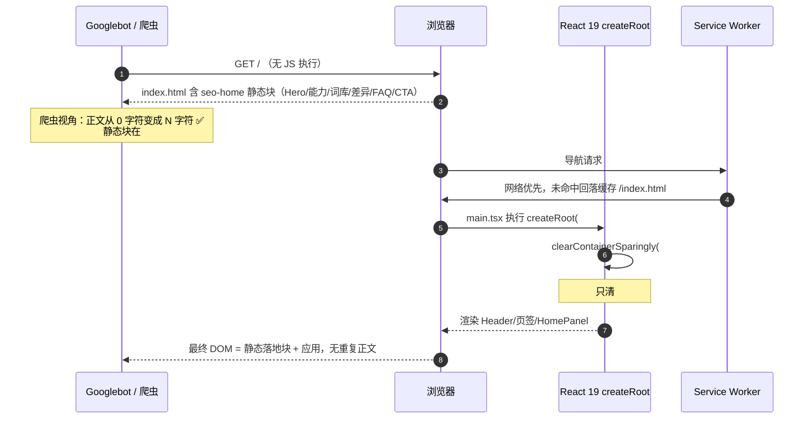
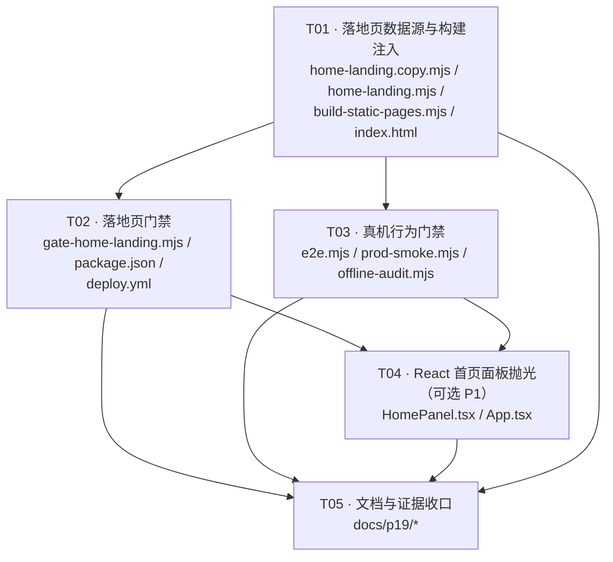

# geek-typing · 首页落地页静态化 + 产品页完善（增量架构方案）

> 状态：**设计稿（本轮不写实现）**
> 仓库：`D:\work\geek-typing`　生产：`https://geek-typing.pages.dev`（Cloudflare Pages，**Wrangler Direct Upload**，非 Git 集成）
>
> ⚠️ **2026-10-06 22:50 纠正**：本文件初稿此处写的是「Cloudflare Pages，**Git 集成**」—— **与实际不符**。
> 实测 `.github/workflows/deploy.yml:319-324` 用 `cloudflare/wrangler-action@v4` +
> `command: pages deploy dist --project-name=geek-typing --commit-dirty=true` +
> `secrets.CLOUDFLARE_API_TOKEN` / `CLOUDFLARE_ACCOUNT_ID` ⇒ **发布由 CI 的 deploy job 直接上传 `dist/`**，
> 与 `docs/audit-package/13-acceptance/PRODUCTION_CHECKLIST.md:264-265` 的记载一致（那份是对的，本文件是错的）。
>
> **这个纠正不是措辞问题，它改变影响面判断**：Git 集成下「push 即自动构建，CI node 版本只影响测试」；
> Direct Upload 下 **CI 构建的 `dist/` 就是发布产物本身** ⇒ CI 的 Node 版本、
> 构建链任何一步的成败**直接决定生产环境内容**。
> 技术栈：React 19.2 + TypeScript ~6.0 + Vite 8.3 + Tailwind 3.4
> 本文中所有体积数字均为**本机实测**（`zlib.gzipSync(..., {level:9})`，与 `check-bundle.mjs` 同口径），非估算。

---

## 0. 实测基线（本轮新增的取证）

设计前先把"哪些是事实、哪些是推演"分开。以下 4 条是**本轮真机实测**得到的，构成本方案的地基。

| # | 实测项 | 方法 | 结果 |
|---|---|---|---|
| E1 | 主 chunk 体积 | 读 `dist/assets/index-CPGVd5pG.js` | **426,052 B raw / 130,283 B gzip**（416.07 / 127.23 KiB） |
| E2 | 体积门禁阈值 | 按 `gate-perf.mjs` `computeEffective` 手算 min-strict | raw eff **450,000 B**（absolute 卡住，derived 489,903 / 492,573 都更宽）<br>gzip eff **145,000 B**（absolute 卡住，derived 149,803 更宽） |
| E3 | **React 19 是否清空 `#root` 内的静态节点** | 造探针页：同一份 `dist` 产物，`#root` 内放标记块 + `#root` 后放标记块，真实 Chrome 加载后读 DOM | `#root` 内标记 **`insideExists: false`**（已被清）<br>`#root` 外标记 **`outsideExists: true`**（存活）<br>应用 `home-panel` 正常挂载，`pageErrors: []` |
| E4 | 真实规模落地块体积 | 7 区块中文文案 + 内联 `<style>` 拼装后实测 | 静态块 **1,256 B raw / 776 B gzip**；`index.html` 2,007 B → 3,263 B |

**E3 是整个方案的枢纽**：它把"静态块放 `#root` 内还是外"从口味之争变成有实测答案的工程决策 —— 必须放 `#root` **外**，否则 React 首次 commit 时 `clearContainerSparingly` 会把它删掉。



---

## 1. 实施路线（3 条，逐条核算）

三条路线共用同一个产物形态：**一个由构建期生成的、位于 `#root` 之外的静态 HTML 块**。分歧在于"由谁生成、放在哪、代价多少"。

### 路线 A：构建后注入 `dist/index.html`（静态块在 `#root` 外）✅ 推荐

**做法**：复用现成的 `scripts/seo/build-static-pages.mjs`（已经排在 `vite build` **之后**，`readSiteOrigin()` / `escapeHtml` / 门禁都在），在 `main()` 末尾多一步 `injectHomeLanding(dist/index.html)`。静态块自带 `<style>`（沿用 `renderBankPage` 的内联样式先例），**不依赖 Tailwind**。

**实测代价**：

| 指标 | 增量 | 说明 |
|---|---|---|
| 主 chunk raw | **0 B** | 不 import 任何东西进 `src/` |
| 主 chunk gzip | **0 B** | 同上 |
| raw 余量 | 23.39 → **23.39 KiB**（不变） | 450,000 − 426,052 |
| gzip 余量 | 14.37 → **14.37 KiB**（不变） | 145,000 − 130,283 |
| `index.html` | 2,007 B → **约 12–16 KB** | 8 区块 + 内联样式；**当前无任何门禁对 index.html 体积判红**（已全仓核查：`check-bundle` / `gate-perf` 只读 `dist/assets`） |
| HTML gzip 传输 | 约 4–6 KB | `prod-smoke` A3+ 已断言 `/` 走 gzip/br 边缘压缩，既有事实 |
| SW 预缓存 | `/index.html` 每条 +约 13 KB | 8s 单条超时预算远够；`offline-audit` 态4 只断言条目 pathname 存在，不判体积 |

**对既有门禁的影响**：

| 门禁 | 影响 | 依据 |
|---|---|---|
| `check:bundle` | **零影响** | 6 条判据全部只读 `dist/assets/**` |
| `gate:perf` | **零影响** | 只读 `dist/assets` + `docs/_generated/perf-baseline.json` |
| `gate:seo-pages` | 判据 1/2/3/4/5/6/7/8/9/11/12/13 **全绿**；判据 10 **零改动** | sitemap 仍 14 条、页面仍 13 个、canonical 仍不带 `.html`；`renderHomeLandingBlock` 刻意**不含 `Page` 子串** → 判据 10 的 `render[A-Za-z0-9_]*Page[A-Za-z0-9_]*\s*\(` 正则**数不到它**，且它住在独立文件里，`BUILDER_SRC` 根本读不到 |
| `verify:ui-contract`（INV-2，21 断言） | **零影响** | `UI_SCOPE_RE` = `src/App.tsx｜main.tsx｜components/**｜hooks/**` ∪ `UI_EXTRA_FILES`；本路线**不改任何 `src/` 文件** |
| `verify:p17-frozen`（INV-1） | **零影响** | 冻结路径仅 `docs/audit-package/`，新文档落 `docs/p19/` |
| `test:e2e` / `test:offline` | **需新增断言**（见 T03），不是被破坏 | 新增真机探针守住"落地块在 React 挂载后仍存活"这条不变量 |
| `verify:registry` / `content:validate` / `verify:aggregate` / `verify:prod-catalog` / `verify:manifests` | **零影响** | 落地文案不是内容包，不进 `content/`，不碰 registry |

**实现复杂度**：低。一个纯函数模块（`render` + `inject`）+ `main()` 里 3 行调用。零新依赖、零 `src/` 改动、零 hydration 风险。

**PWA / SW / 离线**：**不破坏，且增强**。`public/sw.js` 的 `SHELL` 已含 `/index.html`，落地块随 index.html 一起被预缓存 ⇒ 断网首次访问也能看到完整落地页（现在断网只能看到空壳 root）。

**UI 契约门**：**不触发**（不改 `src/`）。

**中文静态正文会不会被 React 覆盖**：**不会** —— 因为它不在 `#root` 里（E3 实测）。

---

### 路线 B：构建期预渲染（`react-dom/server` 渲染真实组件）

**做法**：构建时用 `react-dom/server` 把 `<App/>` 渲成 HTML 写进 `index.html`，客户端 `hydrateRoot`。

**否决理由**：

1. **解决错了问题**。预渲染产出的是**应用自身的 DOM**（问候语、打卡进度、推荐卡），Google 看到的仍是"一个练习工具"，拿不到任何落地页营销文案、关键词布局、差异化论证、FAQ。需求要的是落地页，不是把练习面板搬到 HTML 里。
2. **`react-dom/server` 已在依赖里（零新增包）不等于零成本**。真跑要过的坎：`useSettings` / `useAnalytics` / `useStreak` 全部直读 `localStorage`；`useBank` 走动态 `import()`；`lib/speech` 摸 `speechSynthesis`；`AppErrorBoundary` / `StrictMode` 语义在 SSR 下无意义。要么给 8 个 hook 全加 SSR 守卫（改动面覆盖 `src/hooks/**` 全部 ⇒ **直接踩 INV-2 的 21 条断言**），要么 SSR 直接抛错。
3. **hydration 不匹配的爆炸半径**。一旦 SSR HTML 与客户端首帧有任何结构差异（日期、localStorage 派生值、StrictMode 双调用），React 19 会报 recoverable error 并**整块重渲染** ⇒ 静态正文在用户浏览器里被自己的应用吃掉，等于白做。
4. **零体积收益**。它 0 字节进主 chunk，但代价是动 `src/hooks/**` 全量 —— 风险收益比是本轮最差的一条。

---

### 路线 C：引入 `preact-render-to-string` 单独渲染落地页组件

**否决理由**：

1. **依赖收益为零**。落地块在 `#root` 之外、**永不被 React 渲染**，所以"用 React 组件渲一遍"没有任何消费方。落地页要的是一个**模板函数**，不是一个运行时组件。
2. **多一条渲染路径 = 多一处漂移**。同一个落地页会有"预渲染 HTML"和"React 组件"两份实现，改文案要改两处 —— 这正是 `gate-seo-pages` 判据 10（INV-6 产物侧延伸）当初判红的同型病。
3. **"devDependency 所以不进 bundle"这个论证成立但无意义**：它确实 0 字节进主 chunk，但换来的是一份 ~4 KB 的新依赖 + 一条永不执行的渲染路径。零字节的依赖仍是依赖。
4. 若真要用，**必须放 `scripts/` 而非 `src/`** —— 放 `src/` 才会进主 chunk（+约 3 KiB gzip，吃掉 14.37 KiB 余量的 21%）。这条纪律要写进 Shared Knowledge。

---

### 路线 D（记录在案）：把 `/` 变成纯静态页，应用挪到 `/app`

**否决理由**：触碰面巨大且不可逆 —— `manifest.webmanifest` 的 `start_url`、SW `SHELL` 的 `/index.html`、`offline-audit` 态1.5/态2（断网 reload 后必须落 `home-panel`）、`prod-catalog-check`（等 `home-catalog-summary`）、`e2e` 16.0（默认页签是 Home）、P18 六条不变量中的多条。且拆成两个入口 = 两个主 chunk = 首屏成本翻倍。

---

### 选型结论

| 路线 | 主 chunk raw/gzip 增量 | 改 `src/` | 触发 INV-2 | 新依赖 | 破 PWA/离线 | 静态正文被覆盖 | 复杂度 | 裁定 |
|---|---|---|---|---|---|---|---|---|
| **A 构建后注入** | **0 / 0** | 否 | **否** | 0 | 不破（且增强） | **不会**（E3） | 低 | **采纳** |
| B react-dom/server | 0 / 0 | 是（hooks 全量） | **是** | 0 | 有风险 | 会（hydration 不匹配即重渲染） | 极高 | 否决 |
| C preact-render-to-string | 0（若置于 scripts/）/ +3 KiB gzip（若置于 src/） | 视放置 | 视放置 | +1 | 不破 | 不会 | 中 | 否决 |
| D 双入口拆分 | ×2 主 chunk | 是 | 是 | 0 | **破** | 不会 | 极高 | 否决 |

**采纳 A 的三重理由**：
1. **唯一零体积代价的方案** —— raw/gzip 余量一分不占（E1/E2 实测），把 14.37 KiB 的 gzip 余量完整留给未来真正的功能迭代。
2. **唯一不踩 INV-2 的方案** —— 不改 `src/` 一个字节，21 条 UI 契约断言与 6 个桶的棘轮基线全部不受影响。
3. **唯一"改完 SEO 就变好"的方案** —— 关键词落地的是**文案**，不是组件树。另外两条路线产出的是应用 DOM，Google 看到的仍是一个练习工具，拿不到差异化论证与 FAQ。

---

## 2. 首页信息架构（真实中文文案）

**内容排布铁律**：静态落地块（`#root` 外，营销/SEO）**与** React `HomePanel`（`#root` 内，个性化动态）**文案零重叠**。落地块讲"这是什么、为什么、有什么词库、别人怎么说、常见问题"；HomePanel 讲"你今天打了几个、连击几天、哪些词错了"。两块是互补的两层，不是同一句话说两遍。

### 区块清单

| # | 区块 id | 标题（真实文案） | 承载关键词 | 产出 |
|---|---|---|---|---|
| 1 | `gh-hero` | **英语打字练习：程序员的肌肉记忆背单词工具** | 英语打字练习、打字练习、程序员背单词 | H1 + 副标 + 双 CTA |
| 2 | `gh-why` | **为什么用打字练背单词，而不是看着单词表背** | 背单词 | 3 张能力卡 |
| 3 | `gh-banks` | **13 个词库 9486 条词条，考试与技术栈一次覆盖** | AI 大模型词汇、K8s 词汇、云原生词汇、Go 词汇、前端英语词汇 | 词库卡片网格（词数从 `content/` **现算**，不写死） |
| 4 | `gh-diff` | **打字练习工具很多，能顺带背单词的很少** | 打字练习、程序员背单词 | 竞品差异对比 + 定位句 |
| 5 | `gh-voice` | **用户怎么说** | — | 3 条评价（**占位待替换**，见 §7 待明确事项） |
| 6 | `gh-faq` | **常见问题** | 背单词 | `<details>` 原生折叠，**零 JS** |
| 7 | `gh-cta` | **现在就开始练** | 程序员背单词 | 收尾 CTA + 跳到应用锚点 |

### 逐区块文案

**① Hero**
```
H1  英语打字练习：程序员的肌肉记忆背单词工具
副  敲对就变绿，打完就记住。13 个词库 9486 条词条，
    打开浏览器直接敲 —— 无需注册、无需下载、断网也能练。
CTA1 [立即开始练习 ↓]  → #root
CTA2 [先看看词库]      → #gh-banks
```

**② 为什么用打字练背单词**
```
H2  为什么用打字练背单词，而不是看着单词表背
卡1 手指先记住，脑子才记住
    背了就忘，是因为眼睛认得、手不会写。打字逼你把每个字母落到指尖上。
卡2 错在哪一字母，当场就知道
    拼错的一瞬间就变红，不用等第二天回忆起来才发现自己拼不对。
卡3 有节奏，才记得住
    机械键盘音效 + 连击反馈，把背单词变成一件有手感的事。
```

**③ 词库入口**
```
H2  13 个词库 9486 条词条，考试与技术栈一次覆盖
副  下面每个数字都直接来自本站的内容包，不是估的。

  AI 大模型词汇      43 词   ← ai-core
  云原生 K8s 词库    30 词   ← cloud-native
  前端工程化词库      20 词   ← frontend
  Go 骨架代码         50 词   ← go-code
  TS 骨架代码         50 词   ← ts-code
  雅思核心 IELTS   3,000 词   ← ielts
  托福核心         3,000 词   ← toefl
  考研核心         3,000 词   ← kaoyan
  四级 / 六级         84 / 69 词
  IELTS 单元词汇  32 / 30 / 30 词

  ⚠️ 「AI 大模型词汇」「K8s 词汇」「云原生词汇」「Go 词汇」「前端英语词汇」
     这几个词是中文搜索里的真空白 —— 它们不是本站发明的分类，
     是技术人每天真在找、但工具站都没做的那批词。
```

**④ 差异化**
```
H2  打字练习工具很多，能顺带背单词的很少
对位  只测打字速度、不背单词        → 你知道它快，不知道你记住了没有
对位  背单词工具、没有打字          → 记住了，但拼写还是错的
对位  有打字练习、词库是通用四六级    → 考得过试，写不出 commit message

定位  Geek Typing 是程序员的英语肌肉记忆训练器：
      把「敲代码」的手感搬到「背单词」上 ——
      机械键盘音效、IDE 风格皮肤、默写与限时模式、错词本自动排进复习轮。
      13 个词库里，前端 / Go / K8s / AI 大模型这些技术栈词汇
      是别的工具站基本不做的部分。
```

**⑤ 用户评价（占位文案，见 §7）**
```
H2  用户怎么说
卡1  「敲着敲着打字速度就上去了，这是最实在的收获。」
卡2  「以前背了就忘，现在得敲出来，忘不掉。」
卡3  「K8s 那本词库终于有人做了。」
署名  —— 体验官反馈（文案待替换为真实采集内容）
```

**⑥ 常见问题（原生 `<details>`，零 JS 交互）**
```
H2  常见问题

Q  Geek Typing 是做什么的？
A  一个英语打字练习工具：屏幕上出一个单词，你照着敲，敲对了变绿。
   顺带把单词记住 —— 所以它既是打字练习，也是背单词工具。

Q  需要注册吗？
A  不需要。打开网页就能用，没有账号、没有登录、没有广告。

Q  支持离线吗？
A  支持。它可以装成桌面应用，断网也能继续练已经下好的词库。

Q  词库准吗？
A  词条和释义直接来自本站的内容包，没有为了凑数编词。页面上写的词数是实际条数。

Q  手机上能用吗？
A  能，页面是响应式的；不过它是给键盘准备的，横屏或桌面用更顺手。

Q  我是程序员，最该从哪个词库开始？
A  前端工程化词库或 Go 骨架代码 —— 这两个是你每天真会敲到的词。
```

**⑦ 收尾 CTA**
```
H2  现在就开始练
副  无需注册 · 无需下载 · 断网也能练
CTA [立即开始练习 ↓] → #root
```

---

## 3. 文件清单

### 新增

| 相对路径 | 职责 |
|---|---|
| `scripts/seo/home-landing.mjs` | **落地块纯逻辑**：`renderHomeLandingBlock({catalogTotals, bankRows, origin})` → HTML 字符串；`injectIntoIndexHtml(html, block)` → 新的 index.html。**import 本模块不得触发任何写盘**（沿用 `build-static-pages.mjs` 的 `import.meta.url` 纪律）。导出供门禁对账的锚点常量。**函数名刻意不含 `Page` 子串** |
| `scripts/seo/home-landing.copy.mjs` | **中文文案唯一事实源**：区块数组（id / 标题 / 正文 / 关键词）、FAQ、差异化对比、评价占位。纯数据 + 纯字符串，零逻辑 |
| `scripts/seo/gate-home-landing.mjs` | **落地页门禁**（新门，独立于 `gate-seo-pages`）：正文长度 / 关键词覆盖 / 位置在 `#root` 外 / 零 `<script>` / 词数诚实 / 内链规范 / 体积上限 / `--falsify` 自证 |
| `docs/p19/HOME-LANDING-DESIGN.md` | 本设计文档 |
| `docs/p19/HOME-LANDING-EVIDENCE.md` | 证据矩阵（三态：PASS / FAIL / UNKNOWN，UNKNOWN 视为不通过） |
| `docs/p19/README.md` | P19 索引 |

### 修改

| 相对路径 | 改动 |
|---|---|
| `scripts/seo/build-static-pages.mjs` | `main()` 末尾接入 `injectHomeLanding(dist/index.html)`；**不改** `renderBankPage`、不改判据 10 相关的任何导出 |
| `index.html` | `<title>` / `<meta description>` / `<meta keywords>` / `og:*` 定位更新为落地页口径。**`<div id="root"></div>` 必须逐字保留**（`tests/preview-server.mjs:116` 用 `body.includes('<div id="root">')` 判活）；`<link rel="canonical">` 不动（`readSiteOrigin()` 依赖它） |
| `package.json` | 新增 `gate:home-landing` + `gate:home-landing:falsify` 两个 script（不改 `build`，注入已在 `build:seo-pages` 内） |
| `.github/workflows/deploy.yml` | `gate-build` job 在 `gate:seo-pages` 之后加一步 `- name: 落地页门禁（gate:home-landing） / run: npm run gate:home-landing` |
| `tests/e2e.mjs` | 新增 3 条真机断言：React 挂载后落地块仍在、移动端无横向溢出（含落地块）、落地关键词在 DOM 可见 |
| `tests/prod-smoke.mjs` | A3 之后新增：`/` 正文含落地块、落地块零 `<script>`、bundle 指纹仍可从 index.html 解析 |
| `tests/offline-audit.mjs` | 态4 之后新增：离线缓存里的 `/index.html` 仍能解析出落地块标记 |

### 可选（P1，可跳过）

| 相对路径 | 改动 |
|---|---|
| `src/components/HomePanel.tsx` | 视觉层级抛光（间距 / 标题权重 / 卡片层次）。**⚠️ 触发 INV-2 棘轮**，改前必须先跑 `npm run test:ui-contract` 取基线，改后不得让任何桶上升 |
| `src/App.tsx` | 仅在需要给落地块提供锚点容器时改（可避免：直接用 `href="#root"` 即可） |

---

## 4. 依赖包清单

**新增依赖：0 个。**

本方案刻意做到零新增运行时依赖、零新增开发依赖、零新增运行时 JS 字节。理由已在 §1 核算：主 chunk gzip 余量只有 **14.37 KiB**，任何"看起来很小"的运行时依赖都会吃掉 20%+ 的余量，而本方案的收益（静态正文）**根本不需要在客户端执行任何代码**。

沿用现有依赖（均已在 `package.json`，本方案不新增）：
- `react` / `react-dom` 19.2 —— 运行时，本方案不碰
- `vite` 8.3 —— 构建
- `tailwindcss` 3.4 —— **落地块不使用**（见 Shared Knowledge §3）
- `typescript` ~6.0 / `oxlint` / `ts-morph` —— 门禁与检查链

---

## 5. 任务列表（按依赖顺序）



### T01 · 落地页数据源与构建注入　【P0】

- **文件**：`scripts/seo/home-landing.copy.mjs`（新）、`scripts/seo/home-landing.mjs`（新）、`scripts/seo/build-static-pages.mjs`（改 `main()`）、`index.html`（改 meta）
- **依赖**：无
- **验收**：
  1. `npm run build` 后 `dist/index.html` 含 `id="seo-home"` 块，且该块**字符串位置在 `id="root"` 之前**，且**不在** `<div id="root">…</div>` 的开闭标签之间
  2. `dist/index.html` 的 `<div id="root"></div>` **逐字未变**（`tests/preview-server.mjs:116` 依赖）
  3. `npm run check:bundle` 主 chunk 仍为 **426,052 B raw / 130,283 B gzip**（增量必须**恰为 0 B**；这是本路线的存在理由，必须断言而不是"看一眼"）
  4. `npm run gate:seo-pages` 13 条判据全绿（尤其判据 10 仍为 1 个模板函数）
  5. 词库卡片的词数与 `content/vocabulary/*/words.json` 逐包相等（现算，禁止写死）
  6. 落地块内 `<script>` 数量 = 0
  7. `dist/index.html` 体积 ≤ 32 KiB

### T02 · 落地页门禁　【P0】

- **文件**：`scripts/seo/gate-home-landing.mjs`（新）、`package.json`（加 2 个 script）、`.github/workflows/deploy.yml`（加 1 步）
- **依赖**：T01
- **判据**（每条都配一条 `--falsify` 注入，断言"恰好该判据转红"）：

  | # | 判据 |
  |---|---|
  | H1 | `dist/index.html` 含落地块锚点，且**剥离 `<div id="root">…</div>` 后仍能找到**（证明它在 root 外，不是"恰好没被清"） |
  | H2 | 落地块去标签正文 ≥ **800 字符** |
  | H3 | 9 个目标关键词全覆盖：英语打字练习 / 背单词 / 打字练习 / 程序员背单词 / 前端英语词汇 / Go 词汇 / 云原生词汇 / K8s 词汇 / AI 大模型词汇 |
  | H4 | 落地块内 `<script` 出现 **0** 次（零运行时 JS 的机器自证） |
  | H5 | 词数诚实：落地块每个词库卡片的数字 == `content/vocabulary/<id>/words.json` 真实长度（照抄 `gate-seo-pages` 判据 12 的做法） |
  | H6 | 内链规范：落地块指向词库页的 `href` 全部 == `canonicalBankUrl()` 形态（**不含 `.html`**），且覆盖 ≥ 10 个包 |
  | H7 | 落地块 raw ≤ **32 KiB** |
  | H8 | 首页 `<title>` / `<description>` 与 13 个词库页**均不相同**（防与 `gate-seo-pages` 判据 6/7 撞车） |
  | H9 | 落地块不含任何 `data-testid`（不与 React 断言体系纠缠） |

- **三态纪律**：PASS / FAIL / UNKNOWN，**UNKNOWN 视为不通过**（沿用全仓既有约定）；产物缺失 = fatal exit 2，**绝不降级成 PASS**。
- **接入**：`gate-build` job，紧跟 `gate:seo-pages` 之后（`dist/` 已就绪，零额外 build，不动 `needs` 拓扑与 `timeout-minutes`）。`--falsify` 不进 CI（沿用既有约定）。

### T03 · 真机行为门禁　【P0】

- **文件**：`tests/e2e.mjs`、`tests/prod-smoke.mjs`、`tests/offline-audit.mjs`
- **依赖**：T01
- **新增断言**：
  1. **e2e**：`#root` 已挂载（`home-panel` 存在）**之后**，`#seo-home` 仍存在且 `innerText` 仍含主关键词 —— 这条直接把 E3 实测（`insideExists:false` / `outsideExists:true`）固化成不变量，防止后人"好心"把块挪进 `#root`
  2. **e2e**：移动端 390px 下 `documentElement.scrollWidth - innerWidth ≤ 2`（现有断言自动覆盖落地块，**必须绿**；落地块 CSS 须用 `max-width` + `overflow-wrap`，禁止固定 px 宽度）
  3. **e2e**：FAQ `<details>` 点击可展开（零 JS 原生交互可用）
  4. **prod-smoke**：`/` 响应体含落地块；落地块内 `<script` 为 0；`localFingerprints()` 仍能从 index.html 解析出 `/assets/index-*.js`
  5. **offline-audit** 态4：离线缓存里的 `/index.html` 仍能解析出落地块标记
- **纪律**：每条新断言必须配"**必须判红的合成对照组**"（沿用 `audit-a11y-viewports.mjs` 的防假通过纪律）—— 否则"没断言到"和"断言了但恒绿"分不开。

### T04 · React 首页面板抛光　【P1 · 可跳过，跳过则 T01–T03 即完整交付】

- **文件**：`src/components/HomePanel.tsx`（改）、`src/App.tsx`（可选）
- **依赖**：T02、T03
- **⚠️ 硬约束**：改动前必须先跑 `npm run test:ui-contract` 记录 6 桶基线；改后**任一桶不得上升**。两个硬零桶（`tableJsonImports` / `packageBranches`）必须保持 0。
- **文案纪律**：只调布局与视觉层级，**不新增与落地块重叠的文案**。落地块讲"这是什么"，HomePanel 讲"你今天练了什么"。

### T05 · 文档与证据收口　【P1】

- **文件**：`docs/p19/HOME-LANDING-DESIGN.md`、`docs/p19/HOME-LANDING-EVIDENCE.md`、`docs/p19/README.md`
- **依赖**：T01、T02、T03（+T04 若做）
- **纪律**：文档落 `docs/p19/`，**不得进 `docs/audit-package/`**（INV-1 冻结区，`verify:p17-frozen` 判红）。证据矩阵三态化，UNKNOWN 视为不通过。

---

## 6. 共享知识（跨文件约定）

```
1. 落地块的唯一注入点 = build-static-pages.mjs 的 main() 末尾。
   排在 vite build 之后是硬约束：vite 未配 emptyOutDir，会清空 dist/。
   新增任何"构建后处理"都挂在这一步，不要另起 build 脚本（会踩「下次单独跑 vite build 回退」的老坑）。

2. siteOrigin 的唯一事实源 = readSiteOrigin()（index.html canonical → public/sitemap.xml 首 loc）。
   落地块的 canonical / og:url / 内链一律调它，不新造常量。

3. 落地块【不使用 Tailwind Utility】。理由：tailwind.config.js 的 content 只扫
   './index.html' 与 './src/**'，而注入发生在 vite build【之后】——
   那时 Tailwind 已编译完毕，注入的 class 名不在产物 CSS 里 ⇒ 静默无样式。
   落地块必须自带 <style>（沿用 renderBankPage 的内联样式先例）。

4. 落地块的一切 CSS 作用域锁在 #seo-home 下。选择器一律 #seo-home xxx
   （id 优先级 100，压得住 Tailwind utility），禁止裸标签选择器与 body/html 全局规则。

5. 所有会被搜索引擎读到的 href 必须有名有姓地导出，供门禁断言。
   凡是"同一个 URL 在多处各写一遍"，历史上整齐地一起写错过（.html 三处分叉）。

6. 落地块函数名一律【不含 Page 子串】（renderHomeLandingBlock，不是 renderHomeLandingPage）。
   gate-seo-pages 判据 10 数的是 render…Page…(，含 Page 会被计成第二个页面模板 ⇒ 当场判红。
   同时落地逻辑住在独立文件，gate-seo-pages 的 BUILDER_SRC 根本读不到它。

7. 文案唯一事实源 = scripts/seo/home-landing.copy.mjs。
   任何区块文案改动只改这一个文件；门禁从它派生关键词期望值，不在门里另写一份。

8. 词数/条目数一律现算：词库词数读 content/vocabulary/<id>/words.json 的真实长度；
   汇总口径复用 tests/helpers/catalog-totals.mjs（packages / allTypesItems / vocabularyOnlyItems）。
   绝不写死数字 —— 写死过的两处已腐坏成 18/9388（见 catalog-totals.mjs 文件头事故记录）。

9. 零新增运行时依赖是本项目的硬约束，不是偏好。
   主 chunk gzip 余量仅 14.37 KiB。任何新依赖进 src/ 前必须先算 gzip 增量并对照余量。
   构建期用的库放 scripts/（不进 bundle），但先问"它有没有消费方"。

10. 门禁三态：PASS / FAIL / UNKNOWN，UNKNOWN 视为不通过（exit 1）。
    脚本自身错误 exit 2。产物缺失一律 fatal，绝不"文件不存在就跳过"。

11. 不 spawn 子进程。本机预加载 safe-delete / brokered-fs shim，同步 spawn 一律 EBUSY。
    证伪隔离副本一律落 node_modules/.tmp/（已 gitignore），绝不动真产物。

12. 注入物不得引入 data-testid。落地块是给爬虫与首屏读的，
    不是 React 断言的挂载点 —— 两者混用会让测试同时依赖两套生命周期。

13. 任何"实测结论"必须标注它是被什么方法测出来的。
    本轮 E3（React 清空 #root 内静态节点）就是靠真机探针测出来的，
    不是从 React 源码推的 —— 这类结论决定架构，必须实测。
```

---

## 7. 待明确事项

| # | 事项 | 为什么必须先定 | 建议默认值 |
|---|---|---|---|
| Q1 | **用户评价文案的真实性** | 项目既有纪律明写"不许编造数字"（`catalog.ts` 文件头），编造用户评价是同类问题。写死假评价并让门禁锁死它，会把一句谎话变成不可删除的契约 | 区块结构与 `data-*` 钩子先落地，**文案标记为待替换**，门禁**不断言具体评价文字**（只断言区块存在且 ≥3 条）。真实文案采集后替换 |
| Q2 | **落地块放 `#root` 前还是后** | 放前 = 真落地页（首屏即定位与关键词，Google 移动优先更友好），但老用户每次打开要多滚一屏才摸到应用，与"打开就练"的既有承诺有张力；放后 = 工具优先、SEO 也在，但首屏看不到定位，弱化了"产品页完善"的需求 | **放前**（`#root` 之前）。做成配置项以便日后翻转。缓解：Hero 双 CTA + 顶部"跳过介绍，直接开始练习"链接 + 落地块控制在 8 区块以内 |
| Q3 | **`index.html` 的 title/description 是否本轮就改** | 改了更贴落地页定位；但 `gate-seo-pages` 判据 6/7 要求首页 title/description 与 13 个词库页均不同，改动必须一次性对齐，且需确认 Google 已抓取的旧 title 不构成变更风险 | 本轮改，与落地块文案同源（`home-landing.copy.mjs` 派生），门禁 H8 守住 |
| Q4 | **T04（React 面板抛光）本轮做不做** | 做则触碰 INV-2 棘轮，有门禁风险与工期；不做则 T01–T03 已交付"首页成为落地页"的完整效果 | **建议本轮不做**，作为独立后续任务。跳过不阻塞交付 |
| Q5 | **落地块的目标正文长度** | 800 字符（H2 判据）是按 8 区块中文文案估的；TypeWords 是 68,751 B、Qwerty Learner 仅 9,137 B（空壳）。定太低会被判为薄内容，定太高会稀释首屏 | 先取 **≥ 800 字符**门禁，实测产出后若显著富余再抬阈值（棘轮只许升不许降的操作要留痕） |
| Q6 | **词库卡片是否全部展开 13 个** | 13 张卡片会让区块 3 很长。合并同类（雅思单元词汇 3 包合成 1 张、CET 4/6 合成 1 张）后是 9 张，覆盖关键词不变 | 合成到 **9 张**，但门禁 H5 仍逐包核对真实词数 |
| Q7 | **`public/sitemap.xml` 的双写** | `build-static-pages.mjs` 结尾同时写 `dist/` 与 `public/` 两份（文件头有详细理由）。落地块不新增 URL（仍是 14 条），**不需要动 sitemap** | 不动。但需确认注入步骤不打断这两份写入的顺序 |

---

## 8. 本方案不做的事（明确划界）

- **不新增内容包、不动 `content/`** —— 落地文案是营销内容，不是内容包；放进 `content/` 会踩 `gate-license` 的"未知内容类型目录 fail-closed"。
- **不新增独立落地页 URL**（如 `/about`、`/features`）—— 首页自己就是落地页，拆多页会分散权重且增加薄页风险（`build-static-pages.mjs` 文件头已裁定"绝不做分页、绝不生成薄页"）。
- **不改 `public/sw.js`** —— `SHELL` 已含 `/index.html`，落地块自动进预缓存，改 SW 只会引入缓存版本升级风险（且 `prod-smoke` A2 断言 `gt-shell-v3` 版本串）。
- **不动 `docs/audit-package/`** —— INV-1 冻结区。
- **不碰 `check-bundle` / `gate-perf` 的任何阈值** —— INV-3 明令禁止上调预算，且本方案本来就不需要（增量 0 B）。